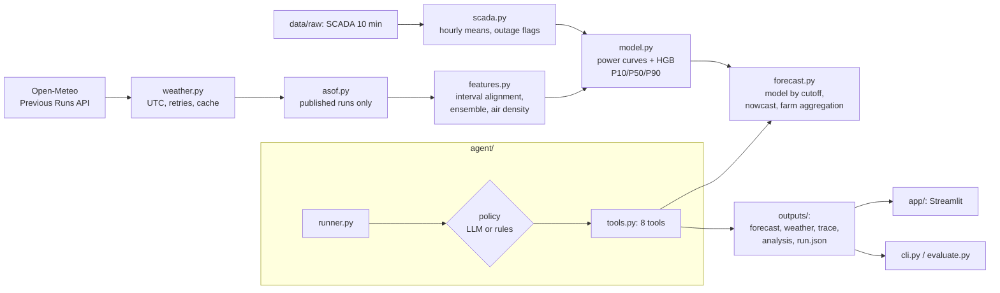

> The Russian version ([README.md](README.md)) is authoritative. This is a faithful English translation.

# 1. Project name

**WindAgent — Agentic AI for 24–48 h hourly wind-farm generation forecasting**
(case "Agentic AI for wind-farm generation forecasting": wind farm near Shelek, Almaty region, 2 turbines)

---

# 2. Short description

**Problem.** Wind-farm output depends on wind, which changes within hours. The farm operator and the grid dispatcher
need the hourly output profile for the next day in advance: for schedules, reserves and fewer imbalances. The forecast
may only use data that was actually available at the moment the forecast is made.

**For whom:** wind-farm shift staff, grid dispatchers, market participants responsible for balancing.

**What the solution does.** Every day at 00:00 (data clock, UTC+6) an AI agent runs the full cycle on its own:
1. retrieves archived forecasts of 4 weather models that were **published before the forecast moment**;
2. checks their quality;
3. runs the ML model;
4. publishes an hourly 48 h forecast with a P10–P90 uncertainty band and an analysis;
5. 6 h later it re-downloads the weather forecasts and checks, for every remaining hour, whether a fresher run has appeared; if the inputs changed, it **recomputes the forecast** (version 2) and records the reason.

The test period 01–28.02.2026 is reproduced "as if in the past": 29 issues, from 31.01 to 28.02.

**Key results** (this block is generated from the files in `outputs/`):

<!-- METRICS:START -->
**Walk-forward validation** (2025-10, 2025-11, 2025-12, 2026-01; 123 daily issues, farm = mean of the two turbines, normalized power 0–1):

| Method | MAE day-ahead (24–47 h) | RMSE day-ahead | MAE intraday (0–23 h) |
|---|---|---|---|
| **WindAgent (our model)** | **0.168** | 0.228 | 0.157 |
| Power curve of the best single NWP model | 0.189 | 0.243 | 0.182 |
| Climatology (month × hour) | 0.325 | 0.362 | 0.326 |
| Persistence (last hour) | 0.368 | 0.478 | 0.299 |

Day-ahead MAE improvement: 48.3% vs climatology, 54.3% vs persistence, 11.3% vs the raw NWP power curve.
P10–P90 interval: coverage before calibration 0.717; widening factor k = 1.07 (fitted on 2025-10, 2025-11, 2025-12); out-of-sample check on 2026-01: 0.713 → **0.799** (target 0.80).
Transfer to an unseen turbine: trained only on t1 → MAE t2 = 0.181 (vs trained on both 0.178).

**Test period:** 29 issues (2026-01-31 … 02-28, 00:00 data clock), 58 published versions, agent policy: llm/openai (gpt-5.4-mini); weather-model exclusions: 0; submission rows: 672.
Post-hoc check of the Jan 31 issue (intraday part, actuals exist): MAE 0.185 over 24 h.

**SCADA clock:** estimated UTC+6, configured UTC+6; temperature-peak time stable within 10 min across years; no duplicates/gaps at 2024-03-01 00:00.

_Generated by `python -m windagent report` from `outputs/shelek/…`; do not edit by hand._
<!-- METRICS:END -->

---

# 3. What is implemented

| Capability | Where in the code | Evidence |
|---|---|---|
| **Agent loop.** 8 tools, agent decisions, versioned publishing, a trace of every step | [`src/windagent/agent/`](src/windagent/agent/) (`tools.py`, `runner.py`) | [`tests/test_agent.py`](tests/test_agent.py), `outputs/shelek/runs/*/trace.jsonl` |
| **LLM policy** (OpenAI; NVIDIA NIM as a backup provider) with tool calling and **automatic fallback** to a deterministic rules policy | [`agent/llm.py`](src/windagent/agent/llm.py), [`agent/rules.py`](src/windagent/agent/rules.py) | `run.json` → `policy/provider/model`; fallback test without a key |
| **As-of guarantee.** Only weather runs published before the forecast moment are used (runtime check + tests) | [`src/windagent/asof.py`](src/windagent/asof.py) | [`tests/test_asof.py`](tests/test_asof.py), each issue's `weather.csv` (`init_time_utc`) |
| **Archived weather forecasts** for the farm's coordinates (ECMWF AIFS, ECMWF IFS, ICON, GFS), UTC only, with retries and a cache | [`src/windagent/weather.py`](src/windagent/weather.py) | `data/cache/shelek/*.parquet`, `run.json` → `weather_source` |
| **ML model.** Isotonic "power curves" per NWP model + gradient boosting, P10/P50/P90, interval calibration | [`model.py`](src/windagent/model.py), [`features.py`](src/windagent/features.py), [`forecast.py`](src/windagent/forecast.py) | `outputs/shelek/validation/metrics.json` |
| **Intraday correction** with fresh SCADA data (only if the data is less than 2 h old); τ = 2 h chosen on validation | [`forecast.py`](src/windagent/forecast.py), [`validation.py`](src/windagent/validation.py) | `run.json` → `nowcast`; `metrics.json` → `nowcast` |
| **Recompute when input data update.** After 6 h the weather is re-downloaded and the as-of selection repeated. For every remaining hour the run behind its inputs is compared. Recompute only if the inputs changed; the LLM may keep version 1 with a reason | `check_for_updates` in [`tools.py`](src/windagent/agent/tools.py) | `run.json` → `versions[].reason` (share of hours with newer runs), `kpis.revision_mae_v2_vs_v1` |
| **Result analysis.** Capacity factor vs climatology, ramps, calm and high-wind hours, band width, confidence level | `analyze_forecast` in [`tools.py`](src/windagent/agent/tools.py) | each issue's `analysis.md` |
| **Rolling backtest** 31.01–28.02.2026 and the submission file | [`agent/runner.py`](src/windagent/agent/runner.py) | `outputs/shelek/test_period/` |
| **Walk-forward validation** against three baselines + transfer to an "unseen" turbine | [`src/windagent/validation.py`](src/windagent/validation.py) | `outputs/shelek/validation/` |
| **Scoring against actuals** (organizers' CSV format) with clock-shift detection | [`src/windagent/evaluate.py`](src/windagent/evaluate.py) | [`tests/test_evaluate_and_clock.py`](tests/test_evaluate_and_clock.py) |
| **SCADA clock forensics** (the data uses a fixed UTC+6) | [`src/windagent/clock.py`](src/windagent/clock.py) | `outputs/shelek/clock/clock_report.json` |
| **SCADA data analysis:** completeness and gaps, distribution and seasonality, wind vs power, availability flag, relationship between the turbines | [`scripts/eda.py`](scripts/eda.py) | [`docs/DATA_ANALYSIS.md`](docs/DATA_ANALYSIS.md), `docs/figures/eda/` |
| **Real-time mode:** a forecast for the next 48 h from the current moment | `run_now` in [`agent/runner.py`](src/windagent/agent/runner.py) | `python -m windagent forecast --now` |
| **Dashboard** (Streamlit): 5 tabs, RU/EN, run the agent with a live trace | [`app/`](app/) | [`tests/ui/`](tests/ui/) |
| **Reliability.** Input validation, exit codes, clear error messages | [`errors.py`](src/windagent/errors.py), [`cli.py`](src/windagent/cli.py) | [`tests/test_agent.py`](tests/test_agent.py), [`tests/test_timeutil.py`](tests/test_timeutil.py) |
| **Reproducibility.** One command, `python -m windagent verify`, runs the tests, re-runs all 29 agent issues in a temporary folder (on copies of the model and weather cache) and compares the result with the submission, then checks the schema and the clock. Full retraining: `python -m windagent all --offline`. There is a Docker setup (the image is built and running on a server) and a CI workflow; GitHub Actions is currently billing-locked for the organization, so the workflow is run manually | [`cli.py`](src/windagent/cli.py) (`verify`), [`Dockerfile`](Dockerfile), [`.github/workflows/ci.yml`](.github/workflows/ci.yml) | `verify` output: 4 × PASS |

---

# 4. How it works

**Input:** 10-minute SCADA data of the two turbines (`data/raw/`), coordinates (`config/sites.yaml`) and the forecast issue time.
**Output:** an hourly forecast for the farm and for each turbine (mean, P10, P50, P90), plus an analysis and a full log of the agent's actions.

**Issue protocol.**
- A forecast is issued on day D at **00:00 on the data clock** (UTC+6). That is D−1 18:00 UTC, or D−1 23:00 official Astana time.
- Horizon 48 h:
  - hours 0–23 are the intraday forecast for day D;
  - hours **24–47** are the day-ahead forecast for day D+1. This is the "forecast for the next 24–48 hours".
- The 31.01 issue gives the forecast for 01.02, the 01.02 issue the one for 02.02, and so on up to the 27.02 issue with the forecast for 28.02.
- The day-ahead submission has 28 × 24 = 672 hours.

**Agent loop** (the same for the LLM policy and the rules policy):

```
inspect_scada        → freshness and availability of SCADA data before the forecast moment
list_weather_runs    → which weather runs are already published (as-of rule)
fetch_weather        → download archived Open-Meteo forecasts (API; on failure, the cache)
validate_weather     → coverage, implausible values, ensemble spread, outlier model
                       (the agent decides whether to exclude it; at least 2 models remain)
run_forecast         → ML model: P10/P50/P90 per turbine and for the farm
analyze_forecast     → capacity factor vs normal, ramps, uncertainty, revision, confidence level
publish_forecast     → version 1 + analysis for the operator (RU/EN)
-- simulated clock +6 h --
check_for_updates    → weather re-downloaded, as-of selection at the new moment: did the inputs of the remaining hours change?
                       yes → validate → run → analyze → publish v2;  no (or negligible) → version 1 stays
```

**As-of rule.**
- A value from a weather run started at t0 may be used at moment T only if `t0 + publication_delay(model) ≤ T`.
- For each model and each hour, the freshest run that satisfies the rule is used.
- Publication delays were measured from Open-Meteo metadata (`meta.json`) and set with a margin of +1.2 to +1.5 h. The command `python -m windagent provenance` re-measures them and saves the result to `outputs/provenance/provenance.json` (table in section 9).
- The same rule is applied when building the training set, so the model learns from forecasts of the same "age" as in operation.

**What the LLM decides, and what the model computes.**
- **The LLM decides:** the order of actions, excluding models flagged by validation, re-running, whether a recompute is needed on update (or keep the version with a reason), and the analysis text. If the LLM replies with text instead of acting, it is asked once to either carry out the steps or reply KEEP with a reason.
- **The ML model computes:** every number of the forecast. The LLM cannot change the forecast moment or request future data.
- Actual values from the forecast window are never shown to the agent. The comparison with actuals (post-hoc check) happens after publishing and is labelled separately.

---

# 5. Technologies

| Category | What is used | Where |
|---|---|---|
| Language | Python ≥ 3.11 (tested: 3.12 in the Docker image, 3.14 locally) | whole project |
| Data | pandas, NumPy, PyArrow (parquet) | `src/windagent/` |
| ML | scikit-learn: `HistGradientBoostingRegressor` (mean and quantiles 0.1/0.5/0.9), `IsotonicRegression` | `model.py` |
| AI agent | OpenAI Python SDK: chat completions with tool calling. Models: OpenAI `gpt-5.4-mini` (default, configurable), NVIDIA NIM (OpenAI-compatible API, backup provider) | `agent/llm.py` |
| Weather forecasts | Open-Meteo Previous Runs API. Models: ECMWF AIFS 0.25° (AI weather model), ECMWF IFS 0.25°, DWD ICON, NOAA GFS | `weather.py` |
| Interface | Streamlit, Plotly | `app/` |
| Configuration | YAML (`config/sites.yaml`), `.env` (python-dotenv) | `config.py` |
| Tests and checks | pytest, `windagent verify`, Docker, GitHub Actions (workflow; run manually) | `tests/`, `.github/workflows/ci.yml`, `Dockerfile` |

---

# 6. Architecture



| Component | Responsibility |
|---|---|
| `config.py`, `config/sites.yaml` | sites, turbines, data clock, weather models and their delays |
| `scada.py` | reads the organizers' CSV, converts time to UTC, hourly means (≥ 4 of 6 records), "turbine unavailable" flag |
| `weather.py`, `asof.py` | archived forecasts, as-of rule, vectorized selection for training and operation |
| `features.py`, `model.py` | features and model |
| `forecast.py` | forecast for one issue, choice of a model with cutoff ≤ T (trains an as-of model if needed) |
| `agent/` | tools, policies, runner, trace, backtest |
| `validation.py`, `evaluate.py`, `clock.py`, `report.py` | validation, scoring against actuals, clock check, README block generation |
| `api.py` | the only interface for the UI ([`docs/CONTRACTS.md`](docs/CONTRACTS.md)) |

**Scaling.**
- Turbines and sites are defined in `config/sites.yaml`; adding a turbine is a configuration change, not a code change.
- Weather is requested once per site location, not per turbine.
- One model per site (the turbine is a model feature).
- The LLM is called per issue, not per turbine.
- The transfer check to an "unseen" turbine is shown in the results block.

Path to 1000+ turbines (not implemented, a plan):
- a self-hosted Open-Meteo server or a commercial API;
- a SCADA stream into a time-series database;
- an orchestrator triggered by "a new run was published";
- a model registry and drift monitoring;
- portfolio quantile aggregation that accounts for correlations.

---

# 7. Install and run

Everything needed is already in the repository: SCADA data, the cache of archived weather forecasts, the trained model, the results.
An LLM key is **not required**: without a key the agent runs on the rules policy with the same tools.

**Option A — Docker** (simplest):

```bash
docker compose up --build
```

Then open http://localhost:8501. Full recomputation inside the container (offline, rules policy):

```bash
docker compose run --rm pipeline
```

**Option B — Python ≥ 3.11** (tested on 3.12 and 3.14).

Linux / macOS:

```bash
python -m venv .venv && source .venv/bin/activate
pip install -r requirements.txt
python -m windagent info
streamlit run app/streamlit_app.py
```

Windows PowerShell:

```powershell
python -m venv .venv; .\.venv\Scripts\Activate.ps1
pip install -r requirements.txt
python -m windagent info
streamlit run app/streamlit_app.py
```

**Enabling the LLM (optional).**
1. Copy `.env.example` to `.env`.
2. Set `OPENAI_API_KEY` and/or `NVIDIA_API_KEY`. `.env` is never committed.

**CLI commands:**

| Command | What it does |
|---|---|
| `python -m windagent forecast --issue "2026-02-10 00:00" [--policy auto\|llm\|rules] [-v]` | one issue (data clock); `-v` shows the agent trace |
| `python -m windagent forecast --now` | forecast from the current moment (needs internet) |
| `python -m windagent backtest [--offline] [--policy rules]` | 29 issues 31.01–28.02 → `outputs/shelek/test_period/` |
| `python -m windagent validate` | walk-forward validation → `outputs/shelek/validation/` |
| `python -m windagent train` | train the production model (cutoff = the first issue of the test period) |
| `python -m windagent all [--offline]` | validate → train → backtest |
| `python -m windagent evaluate --actuals t1=FILE --actuals t2=FILE` | score against actuals in the organizers' format |
| `python -m windagent detect-clock` | SCADA clock check |
| `python -m windagent verify` | all checks in one command (tests, submission reproduction, schema, clock) |
| `python -m windagent fetch-history` | re-download the forecast archive into the cache |
| `python -m windagent provenance` | re-measure publication delays and check the archive's run mapping (needs internet) |

**Exit codes:** 0 success, 2 invalid input, 3 data unavailable, 4 external service unavailable and no cache. An error is printed as one line, `ERROR: …`.

---

# 8. How to verify

About 5–10 minutes. All steps work offline and without an LLM key.

0. **Everything in one command** (about 3 minutes):

   ```bash
   python -m windagent verify
   ```

   Expect 4 `PASS` lines:
   - tests (`pytest -q`);
   - all 29 issues re-run in a temporary folder, and the submission matches the committed one (`max abs diff 0.00e+00`);
   - submission schema: 672 h, values 0–1, P10 ≤ P50 ≤ P90;
   - the SCADA clock is a fixed UTC+6.

   The same checks, step by step, follow below.

1. **Tests:**

   ```bash
   pytest -q
   ```

   Expected: all tests pass. They include the as-of rule on the real cache, the agent end to end, exclusion of an outlier model, LLM → rules fallback, scoring and the clock check.

2. **One issue with the full agent trace:**

   ```bash
   python -m windagent forecast --issue "2026-01-31 00:00" --policy rules --offline -v
   ```

   Expect 30 steps:
   - SCADA check → runs → download → validation → forecast → analysis → publish v1;
   - after 6 h: "newer runs change the inputs of … 28% … of the remaining hours" → recompute → v2;
   - at the end, the analysis and the post-hoc check against the actuals of 31.01 (MAE 0.1855 over 24 h).

   The result is written to `outputs/shelek/adhoc/`; the committed test-period issues are not overwritten.

3. **Reproduce the February forecast in a separate folder and compare with the submission:**

   Linux / macOS:

   ```bash
   WINDAGENT_OUTPUTS_DIR=repro python -m windagent backtest --offline --policy rules
   ```

   Windows PowerShell:

   ```powershell
   $env:WINDAGENT_OUTPUTS_DIR="repro"; python -m windagent backtest --offline --policy rules; Remove-Item Env:WINDAGENT_OUTPUTS_DIR
   ```

   Then compare:

   ```bash
   python -m windagent compare outputs/shelek/test_period/submission_day_ahead.csv repro/shelek/test_period/submission_day_ahead.csv
   ```

   Expected: `"submission_rows": 672`, then `OK: identical within 0.0002`. The forecast numbers do not depend on which policy drove the agent: the LLM excluded no models.

4. **Data clock:**

   ```bash
   python -m windagent detect-clock
   ```

   Expected: `estimated UTC+6 … Fixed UTC+6 logger clock; no change at the 2024-03-01 switch`.

5. **Scoring against February actuals** (if the jury has actuals files in the dataset format):

   ```bash
   python -m windagent evaluate --actuals t1=feb_turbine_1.csv --actuals t2=feb_turbine_2.csv
   ```

   The command prints MAE, RMSE and bias per turbine and for the farm, and the P10–P90 coverage. If the actuals file is shifted in time (for example, written in UTC+5), it prints a warning and the metrics after re-alignment.

6. **Dashboard:**

   ```bash
   streamlit run app/streamlit_app.py
   ```

   Tabs: "Forecast", "Agent" (run the agent with a live trace), "Validation", "Test period", "How it works".

7. **Invalid requests are handled.** For example:

   ```bash
   python -m windagent forecast --issue "31.01.2026"
   ```

   Expected: `ERROR: Invalid time …` and exit code 2. Also try a date in the future, `--horizon 500` and an unknown turbine in `evaluate`.

8. **(Optional) LLM mode:** set `OPENAI_API_KEY` in `.env`, then:

   ```bash
   python -m windagent forecast --issue "2026-02-10 00:00" --policy llm -v
   ```

   The trace shows LLM messages, and `run.json` contains `"policy": "llm", "provider": "openai"`.

---

# 9. Data and integrations

**SCADA (provided by the organizers), files `data/raw/turbine_1.csv` and `turbine_2.csv`.**
- 10-minute records from 11.03.2023 to 31.01.2026: mean wind (m/s), normalized active power (0–1), temperature (°C).
- There are no actuals for February 2026: the test period is forecast blind.
- **The data clock is a fixed UTC+6.** The logger did not switch to UTC+5 at the 01.03.2024 time-zone change. `detect-clock` reproduces the evidence:
  - no duplicates or gaps at 01.03.2024 00:00;
  - the time of the daily temperature peak did not shift between years;
  - by quarter, the correlation of SCADA wind with weather forecasts peaks at a shift of 5.3–6.2 h (median 5.75, nearest integer UTC+6); the two tests above rule out a clock change.
- Named time zones (for example `Asia/Almaty`) are not used in the code: that would shift all data after March 2024 by an hour.
- Every output file carries three times: `*_data_clock` (UTC+6, as in the dataset), `*_utc`, `*_kz_official` (UTC+5).
- Hours with power below 0.05 at wind above 6 m/s are flagged "turbine unavailable" (outage/curtailment) and excluded from training.

**Open-Meteo Previous Runs API** (`https://previous-runs-api.open-meteo.com/v1/forecast`), no key.
- Variables: wind at 10 m and 100 m, direction at 100 m, temperature at 2 m, surface pressure.
- Offsets `previous_day1…4`: the value for hour v comes from the run started at `floor_6h(v) − N days`. This was checked against exact ECMWF IFS HRES runs (Single Runs API): 48 of 48 values match (`python -m windagent provenance` → `outputs/provenance/provenance.json`).
- Requests use `timezone=UTC` only; responses with a non-zero `utc_offset_seconds` are rejected.

| Model | Archived since | Publication delay (with margin) |
|---|---|---|
| ECMWF AIFS 0.25° (AI weather model) | 19.02.2025 | 7 h |
| ECMWF IFS 0.25° | 07.03.2024 | 9 h |
| DWD ICON | 17.02.2024 | 5 h |
| NOAA GFS | 17.02.2024 | 8 h |

**LLM (optional):** OpenAI API and NVIDIA NIM (OpenAI-compatible endpoint). Keys are set only via `.env`.

Weather data by [Open-Meteo](https://open-meteo.com/), licence CC BY 4.0.

---

# 10. Limitations

1. **No February actuals**, so we cannot measure accuracy in the test period ourselves. Accuracy is shown by walk-forward validation (10.2025–01.2026). February is scored with `evaluate` once actuals are available.
2. **Publication delays are estimates.** They were measured from current Open-Meteo metadata and taken with a margin; actual historical delays may have differed.
3. **Conservative run selection.** The Previous Runs archive is organized in whole-day offsets, so for some hours a slightly older run is used than an operator would have had. We trade a little accuracy for zero leakage.
4. **Short history of the best model.** ECMWF AIFS is archived only since 19.02.2025, so about 11 months of training data exist for it.
5. **Coarse forecast grid in complex terrain.** The weather models' grid is 9–25 km, while the site sits in a valley corridor. ML corrects systematic errors, but not all of them.
6. **No rated capacity.** "Farm" here is the mean of the two turbines in normalized units. MW are produced only if `rated_mw` is set in `config/sites.yaml`.
7. **Outages, curtailment and icing are not predicted from weather.** The model forecasts output with the turbines available.
8. **No retraining in February**, because there are no new actuals. The `train` command supports retraining.
9. **Time conventions.** The UTC+6 offset was established statistically, not from documentation. The 10-minute interval label (start or end, ±10 min) is taken as the start of the hour.
10. **Rare extremes are poorly learned.** Winds near the cut-out threshold and storms are rare in the history.
11. **The LLM's analysis text may differ between runs.** The forecast numbers do not depend on the LLM.
12. **The farm's P10–P90 band** is the mean of the turbines' quantiles. This is acceptable because the turbines are highly correlated (≈ 0.97), but it is an approximation.
13. **The free Open-Meteo API** is for non-commercial use. Real-time mode needs internet; the backtest runs offline from the cache.
14. **The demo has no authentication**; LLM runs in the interface are rate-limited.
15. **GitHub Actions is billing-locked for the BAITC-Hacks organization**, so the CI workflow does not run automatically. `python -m windagent verify` performs the same checks (section 8).

---

# 11. Deployed version

**https://windagent.kunai.kz**

- The Streamlit dashboard from this repository: a Docker image on the team's server, nginx, HTTPS (Let's Encrypt).
- Shows the committed test-period and validation results.
- Lets you run the agent for any issue time and make a forecast from the current moment. During the hackathon, LLM runs are rate-limited; without a key on the server, the rules policy runs.
- The deployed version does not replace running from the repository (section 7).

---

## Appendix A. Repository structure

```
config/sites.yaml             sites, turbines, data clock
data/raw/                     the organizers' SCADA (ASCII file names)
data/cache/shelek/            cache of archived weather forecasts (parquet)
models/shelek/                production model (cutoff 31.01.2026 00:00 data clock)
outputs/shelek/runs/          29 issues: forecast.csv, weather.csv, trace.jsonl, analysis.md, run.json
outputs/shelek/test_period/   submission_day_ahead.csv (672 h), all_issues.csv
outputs/shelek/validation/    metrics.json, predictions.csv
outputs/shelek/clock/         clock_report.json
outputs/provenance/           measured publication delays and the archive-offset check
src/windagent/                core (see section 6)
app/                          Streamlit dashboard
scripts/eda.py                generator of docs/DATA_ANALYSIS.md
tests/                        core tests (tests/*.py), UI (tests/ui) and CLI black-box tests (tests/qa)
docs/CONTRACTS.md             file schemas, API and CLI
docs/DATA_ANALYSIS.md         SCADA data analysis with figures (docs/figures/eda/)
docs/presentation/            demo script and answers to jury questions
```

## Appendix B. Team

SDUTIA. Development took place in this repository within the hackathon's 5-hour limit.
