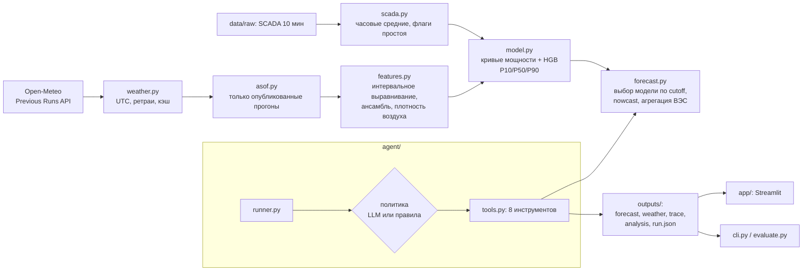

# 1. Название проекта

**WindAgent — Agentic AI для почасового прогноза выработки ВЭС на 24–48 часов**
(кейс «Agentic AI для прогнозирования выработки ВЭС», ВЭС у Шелека, Алматинская область, 2 турбины)

English version: [README.en.md](README.en.md)

---

# 2. Краткое описание

**Проблема.** Выработка ВЭС зависит от ветра, который меняется за часы. Оператору ВЭС и диспетчеру нужно заранее знать
почасовой профиль выработки на следующие сутки: для графика, резервов и снижения небалансов. Прогноз должен
строиться только на тех данных, которые реально были доступны в момент прогноза.

**Для кого:** дежурный персонал ВЭС, диспетчер энергосистемы, участник рынка, который отвечает за баланс.

**Что делает решение.** AI-агент каждый день в 00:00 (время данных, UTC+6) самостоятельно выполняет весь цикл:
1. получает архивные прогнозы погоды 4 моделей, **опубликованные до момента прогноза**;
2. проверяет их качество;
3. запускает ML-модель;
4. публикует почасовой прогноз на 48 ч с интервалом неопределённости P10–P90 и аналитикой;
5. через 6 ч заново загружает прогнозы погоды и по каждому оставшемуся часу проверяет, появились ли более свежие прогоны; если входные данные изменились, **пересчитывает прогноз** (версия 2) и записывает причину.

Тестовый период 01–28.02.2026 воспроизведён «как в прошлом»: 29 выпусков, с 31.01 по 28.02.

**Ключевые результаты** (блок генерируется из файлов в `outputs/`):

<!-- METRICS:START -->
**Валидация walk-forward** (2025-10, 2025-11, 2025-12, 2026-01; 123 ежедневных выпусков, ВЭС = среднее двух турбин, нормированная мощность 0–1):

| Метод | MAE сутки вперёд (24–47 ч) | RMSE сутки вперёд | MAE внутрисуточно (0–23 ч) |
|---|---|---|---|
| **WindAgent (наша модель)** | **0.168** | 0.228 | 0.157 |
| Кривая мощности по лучшей NWP-модели | 0.189 | 0.243 | 0.182 |
| Климатология (месяц × час) | 0.325 | 0.362 | 0.326 |
| Персистентность (последний час) | 0.368 | 0.478 | 0.299 |

Улучшение MAE на сутки вперёд: 48.3% vs климатологии, 54.3% vs персистентности, 11.3% vs кривой мощности NWP.
Интервал P10–P90: покрытие до калибровки 0.717; коэффициент расширения k = 1.07 (подобран на 2025-10, 2025-11, 2025-12); проверка на отложенном месяце 2026-01: 0.713 → **0.799** (цель 0.80).
Перенос на «новую» турбину: обучение только на t1 → MAE t2 = 0.181 (при обучении на обеих турбинах 0.178).

**Тестовый период:** 29 выпусков (31.01–28.02.2026, 00:00 по времени данных), 58 опубликованных версий, политика агента: llm/openai (gpt-5.4-mini); исключений моделей погоды: 0; строк в сабмите: 672.
Пост-проверка выпуска 31.01 (внутрисуточная часть, факт есть): MAE 0.185 за 24 ч.

**Часы SCADA:** оценка UTC+6, в конфигурации UTC+6; время пика температуры стабильно в пределах 10 мин между годами; на 01.03.2024 00:00 нет дублей/пропусков.

_Блок сгенерирован командой `python -m windagent report` из `outputs/shelek/…`; не редактировать вручную._
<!-- METRICS:END -->

---

# 3. Что реализовано

| Возможность | Где в коде | Чем подтверждается |
|---|---|---|
| **Агентный цикл.** 8 инструментов, решения агента, публикация версий, трассировка каждого шага | [`src/windagent/agent/`](src/windagent/agent/) (`tools.py`, `runner.py`) | [`tests/test_agent.py`](tests/test_agent.py), `outputs/shelek/runs/*/trace.jsonl` |
| **LLM-политика** (OpenAI; NVIDIA NIM как запасной провайдер) с вызовом инструментов и **автоматическим откатом** на детерминированную политику правил | [`agent/llm.py`](src/windagent/agent/llm.py), [`agent/rules.py`](src/windagent/agent/rules.py) | `run.json` → `policy/provider/model`; тест отката без ключа |
| **Гарантия as-of.** Используются только прогоны погоды, опубликованные до момента прогноза (проверка во время выполнения + тесты) | [`src/windagent/asof.py`](src/windagent/asof.py) | [`tests/test_asof.py`](tests/test_asof.py), `weather.csv` каждого выпуска (`init_time_utc`) |
| **Получение архивных прогнозов погоды** по координатам ВЭС (ECMWF AIFS, ECMWF IFS, ICON, GFS), только в UTC, с ретраями и кэшем | [`src/windagent/weather.py`](src/windagent/weather.py) | `data/cache/shelek/*.parquet`, `run.json` → `weather_source` |
| **ML-модель.** Изотонические «кривые мощности» по каждой NWP-модели + gradient boosting, P10/P50/P90, калибровка интервала | [`model.py`](src/windagent/model.py), [`features.py`](src/windagent/features.py), [`forecast.py`](src/windagent/forecast.py) | `outputs/shelek/validation/metrics.json` |
| **Внутрисуточная коррекция** по свежим данным SCADA (только если данные моложе 2 ч); параметр τ = 2 ч выбран на валидации | [`forecast.py`](src/windagent/forecast.py), [`validation.py`](src/windagent/validation.py) | `run.json` → `nowcast`; `metrics.json` → `nowcast` |
| **Пересчёт при обновлении данных.** Через 6 ч погода загружается заново и повторяется as-of отбор. Для каждого оставшегося часа сравнивается, из какого прогона берутся входы. Пересчёт только если входы изменились; LLM может оставить версию 1 с обоснованием | `check_for_updates` в [`tools.py`](src/windagent/agent/tools.py) | `run.json` → `versions[].reason` (доля часов с новыми прогонами), `kpis.revision_mae_v2_vs_v1` |
| **Анализ результата.** КИУМ против климатической нормы, рампы, штиль и сильный ветер, ширина интервала, уровень уверенности | `analyze_forecast` в [`tools.py`](src/windagent/agent/tools.py) | `analysis.md` каждого выпуска |
| **Скользящий бэктест** 31.01–28.02.2026 и файл сабмита | [`agent/runner.py`](src/windagent/agent/runner.py) | `outputs/shelek/test_period/` |
| **Walk-forward валидация** против трёх бейзлайнов + перенос на «новую» турбину | [`src/windagent/validation.py`](src/windagent/validation.py) | `outputs/shelek/validation/` |
| **Оценка по факту** (формат CSV организаторов) с детекцией сдвига часов | [`src/windagent/evaluate.py`](src/windagent/evaluate.py) | [`tests/test_evaluate_and_clock.py`](tests/test_evaluate_and_clock.py) |
| **Криминалистика часов SCADA** (данные в фиксированном UTC+6) | [`src/windagent/clock.py`](src/windagent/clock.py) | `outputs/shelek/clock/clock_report.json` |
| **Режим реального времени:** прогноз на ближайшие 48 ч от текущего момента | `run_now` в [`agent/runner.py`](src/windagent/agent/runner.py) | `python -m windagent forecast --now` |
| **Дашборд** Streamlit: 5 вкладок, RU/EN, запуск агента с живой трассировкой | [`app/`](app/) | [`tests/ui/`](tests/ui/) |
| **Надёжность.** Проверка входных данных, коды выхода, понятные сообщения об ошибках | [`errors.py`](src/windagent/errors.py), [`cli.py`](src/windagent/cli.py) | [`tests/test_agent.py`](tests/test_agent.py), [`tests/test_timeutil.py`](tests/test_timeutil.py) |
| **Воспроизводимость.** Одна команда `python -m windagent verify` запускает тесты, заново выполняет все 29 выпусков агента во временной папке (на копиях модели и кэша погоды) и сверяет результат с сабмитом, проверяет схему и часы. Полное переобучение: `python -m windagent all --offline`. Есть Docker (образ собран и работает на сервере) и CI-workflow; GitHub Actions в организации сейчас заблокирован биллингом, поэтому workflow запускается вручную | [`cli.py`](src/windagent/cli.py) (`verify`), [`Dockerfile`](Dockerfile), [`.github/workflows/ci.yml`](.github/workflows/ci.yml) | вывод `verify`: 4 × PASS |

---

# 4. Как работает решение

**Вход:** 10-минутные данные SCADA двух турбин (`data/raw/`), координаты (`config/sites.yaml`) и момент выпуска прогноза.
**Выход:** почасовой прогноз по ВЭС и по каждой турбине (среднее, P10, P50, P90) плюс аналитика и полный журнал действий агента.

**Протокол выпуска.**
- Прогноз выпускается в день D в **00:00 по времени данных** (UTC+6). Это D−1 18:00 UTC или D−1 23:00 по официальному времени Астаны.
- Горизонт 48 ч:
  - часы 0–23 — внутрисуточный прогноз на день D;
  - часы **24–47** — прогноз на сутки вперёд, на день D+1. Это и есть «прогноз на следующие 24–48 часов».
- Выпуск 31.01 даёт прогноз на 01.02, выпуск 01.02 — на 02.02, и так далее до выпуска 27.02 с прогнозом на 28.02.
- Сабмит на сутки вперёд содержит 28 × 24 = 672 часа.

**Цикл агента** (одинаковый для LLM-политики и политики правил):

```
inspect_scada        → свежесть и доступность данных SCADA до момента прогноза
list_weather_runs    → какие прогоны погоды уже опубликованы (правило as-of)
fetch_weather        → загрузка архивных прогнозов Open-Meteo (API, при сбое — кэш)
validate_weather     → покрытие, неправдоподобные значения, разброс ансамбля, модель-выброс
                       (агент решает, исключать ли её; остаётся минимум 2 модели)
run_forecast         → ML-модель: P10/P50/P90 по турбинам и ВЭС
analyze_forecast     → КИУМ против нормы, рампы, неопределённость, пересмотр, уровень уверенности
publish_forecast     → версия 1 + аналитика для оператора (RU/EN)
-- часы симуляции +6 ч --
check_for_updates    → погода загружается заново, as-of отбор на новый момент: изменились ли входы оставшихся часов?
                       да → validate → run → analyze → publish v2;  нет (или несущественно) → версия 1 остаётся
```

**Правило as-of.**
- Значение из прогона погоды с началом t0 разрешено использовать в момент T, только если `t0 + задержка_публикации(модель) ≤ T`.
- Для каждой модели и каждого часа берётся самый свежий прогон, который удовлетворяет правилу.
- Задержки публикации измерены по метаданным Open-Meteo (`meta.json`) и заданы с запасом +1.2…+1.5 ч. Команда `python -m windagent provenance` измеряет их заново и сохраняет результат в `outputs/provenance/provenance.json` (таблица в разделе 9).
- То же правило применяется при построении обучающей выборки, поэтому модель обучается на прогнозах того же «возраста», что и в работе.

**Что решает LLM, а что — модель.**
- **Решает LLM:** порядок действий, исключение моделей по флагам проверки, повторный запуск, нужен ли пересчёт при обновлении (или оставить версию с обоснованием), текст аналитики. Если LLM ответил текстом без действий, его один раз просят либо выполнить шаги, либо явно ответить KEEP с причиной.
- **Считает ML-модель:** все числа прогноза. LLM не может изменить момент прогноза или запросить будущие данные.
- Фактические значения из окна прогноза агенту не показываются. Сверка с фактом (пост-проверка) делается после публикации и помечается отдельно.

---

# 5. Технологии

| Категория | Что используется | Где |
|---|---|---|
| Язык | Python ≥ 3.11 (проверено: 3.12 в Docker-образе, 3.14 локально) | весь проект |
| Данные | pandas, NumPy, PyArrow (parquet) | `src/windagent/` |
| ML | scikit-learn: `HistGradientBoostingRegressor` (среднее и квантили 0.1/0.5/0.9), `IsotonicRegression` | `model.py` |
| AI-агент | OpenAI Python SDK: chat completions с вызовом инструментов. Модели: OpenAI `gpt-5.4-mini` (по умолчанию, настраивается), NVIDIA NIM (OpenAI-совместимый API, запасной провайдер) | `agent/llm.py` |
| Прогнозы погоды | Open-Meteo Previous Runs API. Модели: ECMWF AIFS 0.25° (AI-модель погоды), ECMWF IFS 0.25°, DWD ICON, NOAA GFS | `weather.py` |
| Интерфейс | Streamlit, Plotly | `app/` |
| Конфигурация | YAML (`config/sites.yaml`), `.env` (python-dotenv) | `config.py` |
| Тесты и проверка | pytest, `windagent verify`, Docker, GitHub Actions (workflow; запуск вручную) | `tests/`, `.github/workflows/ci.yml`, `Dockerfile` |

---

# 6. Архитектура проекта



| Компонент | Ответственность |
|---|---|
| `config.py`, `config/sites.yaml` | площадки, турбины, часы данных, модели погоды и их задержки |
| `scada.py` | чтение CSV организаторов, перевод времени в UTC, часовые средние (≥ 4 из 6 записей), флаг «турбина недоступна» |
| `weather.py`, `asof.py` | архивные прогнозы, правило as-of, векторный выбор для обучения и для работы |
| `features.py`, `model.py` | признаки и модель |
| `forecast.py` | прогноз одного выпуска, выбор модели с cutoff ≤ T (при необходимости обучается as-of модель) |
| `agent/` | инструменты, политики, раннер, трассировка, бэктест |
| `validation.py`, `evaluate.py`, `clock.py`, `report.py` | валидация, оценка по факту, проверка часов, генерация блоков README |
| `api.py` | единственный интерфейс для UI ([`docs/CONTRACTS.md`](docs/CONTRACTS.md)) |

**Масштабирование.**
- Турбины и площадки задаются в `config/sites.yaml`; добавление турбины — это изменение конфигурации, а не кода.
- Погода запрашивается один раз на координаты площадки, а не на каждую турбину.
- Одна модель на площадку (турбина — признак модели).
- LLM вызывается на выпуск, а не на турбину.
- Проверка переноса на «новую» турбину приведена в блоке результатов.

Путь к 1000+ турбинам (не реализован, план):
- собственный сервер Open-Meteo или коммерческий API;
- поток SCADA в БД временных рядов;
- оркестратор по событию «вышел новый прогон»;
- реестр моделей и мониторинг дрейфа;
- агрегирование квантилей портфеля с учётом корреляций.

---

# 7. Установка и запуск

Всё нужное уже в репозитории: данные SCADA, кэш архивных прогнозов погоды, обученная модель, результаты.
Ключ LLM **не обязателен**: без ключа агент работает на политике правил с теми же инструментами.

**Вариант A — Docker** (самый простой):

```bash
docker compose up --build
```

Затем откройте http://localhost:8501. Полный пересчёт внутри контейнера (офлайн, политика правил):

```bash
docker compose run --rm pipeline
```

**Вариант B — Python ≥ 3.11** (проверено на 3.12 и 3.14).

Linux / macOS:

```bash
python -m venv .venv && source .venv/bin/activate
pip install -r requirements.txt
python -m windagent info
streamlit run app/streamlit_app.py
```

Windows PowerShell:

```powershell
python -m venv .venv; .\.venv\Scripts\Activate.ps1
pip install -r requirements.txt
python -m windagent info
streamlit run app/streamlit_app.py
```

**Включение LLM (опционально).**
1. Скопируйте `.env.example` в `.env`.
2. Укажите `OPENAI_API_KEY` и/или `NVIDIA_API_KEY`. `.env` в git не попадает.

**Команды CLI:**

| Команда | Что делает |
|---|---|
| `python -m windagent forecast --issue "2026-02-10 00:00" [--policy auto\|llm\|rules] [-v]` | один выпуск (время данных); `-v` — трассировка агента |
| `python -m windagent forecast --now` | прогноз от текущего момента (нужен интернет) |
| `python -m windagent backtest [--offline] [--policy rules]` | 29 выпусков 31.01–28.02 → `outputs/shelek/test_period/` |
| `python -m windagent validate` | walk-forward валидация → `outputs/shelek/validation/` |
| `python -m windagent train` | обучить рабочую модель (cutoff = первый выпуск тестового периода) |
| `python -m windagent all [--offline]` | validate → train → backtest |
| `python -m windagent evaluate --actuals t1=ФАЙЛ --actuals t2=ФАЙЛ` | оценка по факту в формате организаторов |
| `python -m windagent detect-clock` | проверка часов SCADA |
| `python -m windagent verify` | все проверки одной командой (тесты, воспроизведение сабмита, схема, часы) |
| `python -m windagent fetch-history` | заново скачать архив прогнозов в кэш |
| `python -m windagent provenance` | заново измерить задержки публикации и проверить сопоставление прогонов архива (нужен интернет) |

**Коды выхода:** 0 — успех, 2 — неверный ввод, 3 — нет данных, 4 — внешний сервис недоступен и нет кэша. Ошибка выводится одной строкой `ERROR: …`.

---

# 8. Как проверить решение

Примерно 5–10 минут. Все шаги работают офлайн и без ключа LLM.

0. **Всё одной командой** (около 1 минуты):

   ```bash
   python -m windagent verify
   ```

   Ожидается 4 строки `PASS`:
   - тесты (`pytest -q`);
   - все 29 выпусков заново выполнены во временной папке, и сабмит совпадает с закоммиченным (`max abs diff 0.00e+00`);
   - схема сабмита: 672 ч, значения 0–1, P10 ≤ P50 ≤ P90;
   - часы SCADA — фиксированный UTC+6.

   Ниже те же проверки по шагам.

1. **Тесты:**

   ```bash
   pytest -q
   ```

   Ожидается: все тесты проходят. Среди них правило as-of на реальном кэше, агент end-to-end, исключение модели-выброса, откат LLM → правила, оценка и проверка часов.

2. **Один выпуск с полной трассировкой агента:**

   ```bash
   python -m windagent forecast --issue "2026-01-31 00:00" --policy rules --offline -v
   ```

   Ожидается 30 шагов:
   - проверка SCADA → прогоны → загрузка → проверка → прогноз → анализ → публикация v1;
   - через 6 ч: «newer runs change the inputs of … 28% … of the remaining hours» → пересчёт → v2;
   - в конце аналитика и «Пост-проверка» по факту 31.01 (MAE 0.186 за 24 ч).

   Результат пишется в `outputs/shelek/adhoc/`; закоммиченные выпуски тестового периода не перезаписываются.

3. **Воспроизведение февральского прогноза в отдельную папку и сверка с сабмитом:**

   Linux / macOS:

   ```bash
   WINDAGENT_OUTPUTS_DIR=repro python -m windagent backtest --offline --policy rules
   ```

   Windows PowerShell:

   ```powershell
   $env:WINDAGENT_OUTPUTS_DIR="repro"; python -m windagent backtest --offline --policy rules; Remove-Item Env:WINDAGENT_OUTPUTS_DIR
   ```

   Затем сверка:

   ```bash
   python -m windagent compare outputs/shelek/test_period/submission_day_ahead.csv repro/shelek/test_period/submission_day_ahead.csv
   ```

   Ожидается: `"submission_rows": 672`, затем `OK: identical within 0.0002`. Числа прогноза не зависят от того, какая политика вела агента: LLM не исключала модели.

4. **Часы данных:**

   ```bash
   python -m windagent detect-clock
   ```

   Ожидается: `estimated UTC+6 … Fixed UTC+6 logger clock; no change at the 2024-03-01 switch`.

5. **Оценка по факту февраля** (если у жюри есть файлы факта в формате датасета):

   ```bash
   python -m windagent evaluate --actuals t1=feb_turbine_1.csv --actuals t2=feb_turbine_2.csv
   ```

   Команда выводит MAE, RMSE и bias по турбинам и ВЭС, а также покрытие P10–P90. Если файл факта сдвинут по часам (например, записан в UTC+5), выводится предупреждение и метрики после выравнивания.

6. **Дашборд:**

   ```bash
   streamlit run app/streamlit_app.py
   ```

   Вкладки: «Прогноз», «Агент» (запуск агента с живой трассировкой), «Валидация», «Тестовый период», «Как это работает».

7. **Некорректные запросы обрабатываются.** Например:

   ```bash
   python -m windagent forecast --issue "31.01.2026"
   ```

   Ожидается `ERROR: Invalid time …` и код выхода 2. Также проверьте дату в будущем, `--horizon 500` и неизвестную турбину в `evaluate`.

8. **(Опционально) LLM-режим:** задайте `OPENAI_API_KEY` в `.env`, затем:

   ```bash
   python -m windagent forecast --issue "2026-02-10 00:00" --policy llm -v
   ```

   В трассировке появятся сообщения LLM, а в `run.json` — `"policy": "llm", "provider": "openai"`.

---

# 9. Данные и интеграции

**SCADA (предоставлено организаторами), файлы `data/raw/turbine_1.csv` и `turbine_2.csv`.**
- 10-минутные записи с 11.03.2023 по 31.01.2026: средний ветер (м/с), нормированная активная мощность (0–1), температура (°C).
- Фактических данных за февраль 2026 нет: тестовый период прогнозируется вслепую.
- **Часы данных — фиксированный UTC+6.** Регистратор не перешёл на UTC+5 при смене часового пояса 01.03.2024. Доказательства воспроизводит `detect-clock`:
  - на 01.03.2024 00:00 нет дублей и пропусков;
  - время суточного пика температуры не сместилось между годами;
  - корреляция ветра SCADA с прогнозами погоды по кварталам максимальна при сдвиге 5.3–6.2 ч (медиана 5.75, ближайшее целое — UTC+6); смену часов исключают два теста выше.
- Именованные часовые пояса (например, `Asia/Almaty`) в коде не используются: это сдвинуло бы все данные после марта 2024 на час.
- Во всех выходных файлах три времени: `*_data_clock` (UTC+6, как в датасете), `*_utc`, `*_kz_official` (UTC+5).
- Часы, где мощность меньше 0.05 при ветре больше 6 м/с, помечаются как «турбина недоступна» (простой/ограничение) и исключаются из обучения.

**Open-Meteo Previous Runs API** (`https://previous-runs-api.open-meteo.com/v1/forecast`), без ключа.
- Переменные: ветер 10 м и 100 м, направление 100 м, температура 2 м, приземное давление.
- Сдвиги `previous_day1…4`: значение на час v берётся из прогона, начатого в `floor_6ч(v) − N суток`. Это проверено сверкой с точными прогонами ECMWF IFS HRES (Single Runs API): 48 из 48 значений совпадают (`python -m windagent provenance` → `outputs/provenance/provenance.json`).
- Запросы только с `timezone=UTC`; ответы с ненулевым `utc_offset_seconds` отклоняются.

| Модель | Архив с | Задержка публикации (с запасом) |
|---|---|---|
| ECMWF AIFS 0.25° (AI-модель погоды) | 19.02.2025 | 7 ч |
| ECMWF IFS 0.25° | 07.03.2024 | 9 ч |
| DWD ICON | 17.02.2024 | 5 ч |
| NOAA GFS | 17.02.2024 | 8 ч |

**LLM (опционально):** OpenAI API и NVIDIA NIM (OpenAI-совместимый endpoint). Ключи задаются только через `.env`.

Данные о погоде — [Open-Meteo](https://open-meteo.com/), лицензия CC BY 4.0.

---

# 10. Ограничения

1. **Нет факта за февраль**, поэтому точность в тестовом периоде мы оценить не можем. Точность показана на walk-forward валидации (10.2025–01.2026). Февраль оценивается командой `evaluate`, когда появится факт.
2. **Задержки публикации — оценки.** Они измерены по текущим метаданным Open-Meteo и взяты с запасом; фактические исторические задержки могли отличаться.
3. **Консервативный выбор прогонов.** Архив Previous Runs устроен по суточным сдвигам, поэтому для части часов берётся чуть более старый прогон, чем был бы доступен оператору. Мы жертвуем долей точности ради отсутствия утечки.
4. **Короткая история лучшей модели.** ECMWF AIFS в архиве только с 19.02.2025, так что по ней около 11 месяцев обучения.
5. **Грубая сетка прогноза в сложном рельефе.** Сетка моделей погоды 9–25 км, а площадка находится в долинном коридоре. ML исправляет систематические ошибки, но не все.
6. **Нет номинальной мощности.** «ВЭС» здесь — среднее двух турбин в нормированных единицах. МВт выдаются только если задать `rated_mw` в `config/sites.yaml`.
7. **Простои, ограничения и обледенение не прогнозируются по погоде.** Модель прогнозирует выработку при доступных турбинах.
8. **Нет переобучения в феврале**, потому что новых фактических данных нет. Команда `train` поддерживает переобучение.
9. **Соглашения о времени.** Сдвиг UTC+6 установлен статистически, а не по документации. Метка 10-минутного интервала (начало или конец, ±10 мин) принята как начало часа.
10. **Редкие экстремумы изучены слабо.** Ветер около порога отключения и штормы в истории редки.
11. **Текст аналитики от LLM может отличаться между запусками.** Числа прогноза от LLM не зависят.
12. **Интервал P10–P90 для ВЭС** — среднее квантилей турбин. Это допустимо, так как турбины сильно коррелированы (≈ 0.97), но это приближение.
13. **Бесплатный API Open-Meteo** предназначен для некоммерческого использования. Режим реального времени требует интернета; бэктест работает офлайн из кэша.
14. **У демо нет авторизации**, запуски LLM в интерфейсе ограничены лимитом.
15. **GitHub Actions в организации BAITC-Hacks заблокирован биллингом**, поэтому CI-workflow не запускается автоматически. Те же проверки выполняет `python -m windagent verify` (раздел 8).

---

# 11. Ссылка на deployed-версию

Пока не развёрнуто. Проект запускается из репозитория (раздел 7).

---

## Приложение A. Структура репозитория

```
config/sites.yaml             площадки, турбины, часы данных
data/raw/                     SCADA организаторов (ASCII-имена файлов)
data/cache/shelek/            кэш архивных прогнозов погоды (parquet)
models/shelek/                рабочая модель (cutoff 31.01.2026 00:00 времени данных)
outputs/shelek/runs/          29 выпусков: forecast.csv, weather.csv, trace.jsonl, analysis.md, run.json
outputs/shelek/test_period/   submission_day_ahead.csv (672 ч), all_issues.csv
outputs/shelek/validation/    metrics.json, predictions.csv
outputs/shelek/clock/         clock_report.json
src/windagent/                ядро (см. раздел 6)
app/                          дашборд Streamlit
tests/                        тесты ядра и UI
docs/CONTRACTS.md             схемы файлов, API и CLI
```

## Приложение B. Команда

SDUTIA. Разработка велась в этом репозитории в рамках 5-часового ограничения хакатона.
