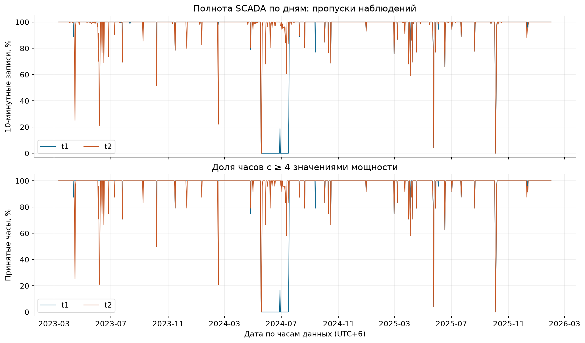
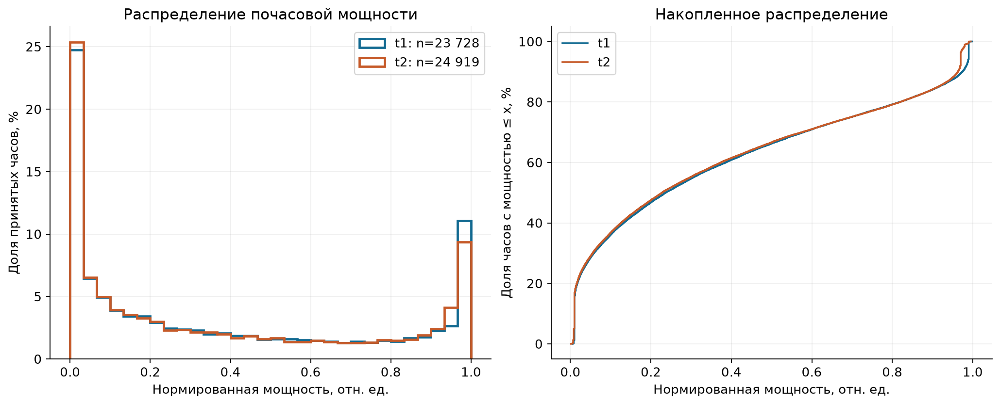
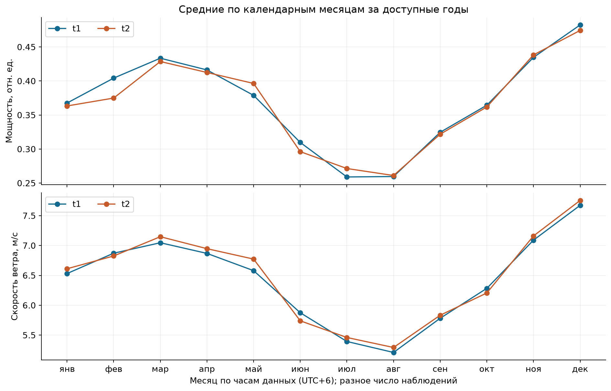
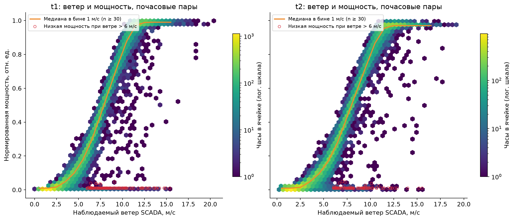
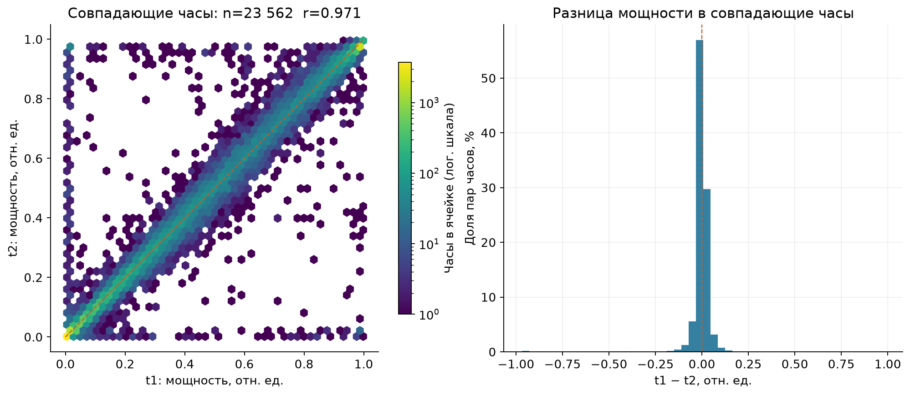

# Анализ исходных данных SCADA

Площадка: **shelek**. Источники: [t1: turbine_1.csv](../data/raw/turbine_1.csv); [t2: turbine_2.csv](../data/raw/turbine_2.csv). Параметры площадки и часы взяты из [конфигурации](../config/sites.yaml). Отчёт описывает наблюдения; точность прогноза здесь не оценивается.

## Основные результаты

- История охватывает **2023-03-11 00:00:00 — 2026-01-31 23:50:00** по часам данных (фиксированный UTC+6). Границы каждой турбины приведены ниже.
- Внутри записанных строк значения могут быть заполнены полностью, но это не означает непрерывную временную историю. t1: отсутствует 9 992 из 152 352 ожидаемых 10-минутных меток (6,56%); t2: отсутствует 2 853 из 152 352 ожидаемых 10-минутных меток (1,87%).
- На 23 562 совпадающих принятых часах корреляция Пирсона мощности равна **0,9710**. Это связь наблюдений соседних турбин, а не проверка переноса модели на новую площадку.
- Число 10-минутных наблюдений в заданном тестовом периоде: t1 — 0; t2 — 0 (2026-02-01 — 2026-02-28).

## Источники и обработка

Столбцы читаются **по позиции**, чтобы не зависеть от языка заголовков:

| Позиция | Значение | Использование |
|---|---|---|
| 1 | ID строки | Не является временной меткой; не используется как признак |
| 2 | Статистическое время | Наивная метка часов данных |
| 3 | Средняя скорость ветра, м/с | `ws` |
| 4 | Нормированная активная мощность, 0–1 | `p` |
| 5 | Средняя температура окружающей среды, °C | `temp` |

Для вычислений время переводится в timezone-aware UTC вычитанием 6 часов. На графиках даты и месяцы показаны по часам данных. Фиксированный сдвиг взят из конфигурации, а не заново установлен этим EDA. Изменения официального часового пояса не применяются автоматически.

Не распознанные времена исключаются; при повторе времени сохраняется первая строка. Отсутствующие, нечисловые и бесконечные измерения становятся пропусками, **не нулями**. Конечные значения вне проверяемых диапазонов отмечаются, но не обрезаются и не удаляются. Исходные CSV не изменяются.

Часовая метка — начало интервала. Принимается час, в котором есть **не менее 4 конечных значений мощности из ожидаемых 6**; мощность, ветер и температура усредняются по своим доступным значениям в этом часе. Это воспроизводит правило `src/windagent/scada.py` для данных без бесконечностей. Порог считается по мощности, он не гарантирует 4 значений ветра или температуры. Пропуски не интерполируются, в том числе перед корреляциями.

## Полнота и качество

| Показатель | t1 | t2 |
|---|---:|---:|
| Строк в CSV | 142 360 | 149 499 |
| Начало (часы данных) | 2023-03-11 00:00:00 | 2023-03-11 00:00:00 |
| Конец (часы данных) | 2026-01-31 23:50:00 | 2026-01-31 23:50:00 |
| Нераспознанных времён | 0 | 0 |
| Повторных временных меток | 0 | 0 |
| Шагов назад в исходном порядке строк | 0 | 0 |
| Модальный шаг, мин | 10 | 10 |
| Меток вне 10-минутной сетки | 0 | 0 |
| Ожидаемых 10-минутных меток | 152 352 | 152 352 |
| Отсутствующих меток сетки | 9 992 | 2 853 |
| Разрывов между соседними метками > 10 мин | 67 | 178 |
| Наибольший интервал между наблюдениями, ч | 999,00 | 57,50 |
| Принятых часовых средних | 23 728 | 24 919 |
| Часов в полном диапазоне | 25 392 | 25 392 |
| Мощность вне [0, 1], строк | 0 | 0 |
| Отрицательный ветер, строк | 0 | 0 |
| Температура вне [−60, +60] °C, строк | 0 | 0 |

Ожидаемая сетка строится между крайними метками каждой турбины. «Разрыв» — интервал между соседними уникальными метками, превышающий номинальный шаг; это не число подряд отсутствующих часов. Диапазон температуры — только широкий порог контроля качества, а не технический предел турбины.

| Турбина | Последняя метка перед самым большим разрывом | Первая после разрыва |
|---|---|---|
| t1 | 2024-05-18 03:40:00 | 2024-06-28 18:40:00 |
| t2 | 2024-05-18 04:00:00 | 2024-05-20 13:30:00 |

| Турбина / столбец | Пропуск или нечисловое значение | ±∞ | Минимум | Максимум |
|---|---:|---:|---:|---:|
| t1 / ветер, м/с | 0 | 0 | 0,00 | 22,97 |
| t1 / мощность, отн. ед. | 0 | 0 | 0,00 | 1,00 |
| t1 / температура, °C | 0 | 0 | -19,26 | 43,48 |
| t2 / ветер, м/с | 0 | 0 | 0,11 | 21,43 |
| t2 / мощность, отн. ед. | 0 | 0 | 0,00 | 1,00 |
| t2 / температура, °C | 0 | 0 | -19,08 | 43,97 |



На графике знаменатели — 144 ожидаемые записи и 24 часа за календарные сутки. Нулевая полнота означает отсутствие наблюдений, а не нулевую выработку. Причина разрывов из этих столбцов неизвестна.

## Распределение и сезонность

Статистики ниже рассчитаны по принятым часам каждой турбины, включая часы с флагом низкой выработки; пропуски за пределами этих часов не восполняются.

| Турбина | Часов | Средняя мощность | Медиана | Q10 | Q90 | Доля p < 0,05 | Доля p ≥ 0,90 | Средний ветер, м/с |
|---|---:|---:|---:|---:|---:|---:|---:|---:|
| t1 | 23 728 | 0,371 | 0,237 | 0,010 | 0,975 | 28,55% | 15,99% | 6,44 |
| t2 | 24 919 | 0,366 | 0,228 | 0,010 | 0,963 | 29,05% | 15,89% | 6,46 |





Средние по календарным месяцам объединяют доступные годы. Это описательная сезонность: разная полнота, состав лет и доступность оборудования могут влиять на сравнение. Это не климатическая норма и не прогноз.

| Месяц | t1: часов / средняя мощность | t2: часов / средняя мощность |
|---|---:|---:|
| янв | 2 232 / 0,368 | 2 229 / 0,363 |
| фев | 1 362 / 0,404 | 1 331 / 0,375 |
| мар | 1 981 / 0,433 | 1 979 / 0,429 |
| апр | 2 134 / 0,416 | 2 096 / 0,412 |
| май | 1 864 / 0,379 | 2 128 / 0,396 |
| июн | 1 433 / 0,310 | 2 072 / 0,296 |
| июл | 1 819 / 0,259 | 2 189 / 0,271 |
| авг | 2 219 / 0,260 | 2 219 / 0,261 |
| сен | 2 153 / 0,325 | 2 156 / 0,322 |
| окт | 2 149 / 0,364 | 2 149 / 0,362 |
| ноя | 2 154 / 0,435 | 2 154 / 0,438 |
| дек | 2 228 / 0,482 | 2 217 / 0,474 |

## Ветер, мощность и флаг доступности



График показывает одновременные наблюдения, а не качество метеопрогноза. Цвет — число часовых пар в ячейке; медиана рассчитана в бинах ветра шириной 1 м/с с минимум 30 парами. Наблюдаемая зависимость нелинейна; линейная корреляция не заменяет кривую мощности.

Эвристика проекта: час помечается при **p < 0,05 и ветре > 6 м/с**. t1: 155 из 23 728 принятых часов (0,65%); t2: 111 из 24 919 принятых часов (0,45%). Это кандидаты для проверки; по мощности, ветру и температуре нельзя установить ремонт, ограничение, обледенение или ошибку датчика. Флаг не является подтверждённым простоем и не прогнозирует будущий отказ.

## Связь между турбинами

| Разрешение / величина | Совпадающих полных пар | Корреляция Пирсона |
|---|---:|---:|
| 10 минут / мощность | 141 357 | 0,9641 |
| 10 минут / ветер | 141 357 | 0,9896 |
| 10 минут / температура | 141 357 | 0,9998 |
| 1 час / мощность | 23 562 | 0,9710 |
| 1 час / ветер | 23 562 | 0,9945 |
| 1 час / температура | 23 562 | 0,9998 |



Пары соединены по одной и той же UTC-метке и отброшены, если хотя бы одно значение отсутствует. Для почасового сравнения каждая турбина отдельно должна пройти порог полноты. Сдвиги и интерполяция не применялись. Внутри одного совпадающего часа средние турбин могут опираться на разные наборы 10-минутных наблюдений. Высокая корреляция может отражать общую погоду и соседство; она не означает независимость турбин и не доказывает причинность.

## Границы обучения и честная оценка

- Начало обучающих выпусков в текущем ядре: **2024-03-10**; cutoff рабочей модели: **2026-01-31 00:00** по часам данных. Источник: [forecast.py](../src/windagent/forecast.py), `TRAIN_START_DATA_CLOCK`, `PRODUCTION_CUTOFF_DATA_CLOCK`. Это границы протокола, а не полный диапазон исходного SCADA.
- При подготовке обучающей строки и свежего наблюдения используется только информация, доступная к выпуску. Само наличие строки в полном CSV не делает её допустимым признаком для более раннего прогноза.
- Месяцы текущей walk-forward валидации: **2025-10, 2025-11, 2025-12, 2026-01**; источник: [metrics.json](../outputs/shelek/validation/metrics.json), `validation.folds`. Каждый месяц проверяется после обучения на прошлом. Статистики и рисунки этого EDA рассчитаны по всей истории и не должны использоваться как готовые параметры преобразований для ранних validation-folds.
- Тестовый период из конфигурации — **2026-02-01 — 2026-02-28**. Число фактических строк в нём посчитано выше. Отсутствие факта исключает измерение февральской точности по этим файлам; опубликованный прогноз нельзя считать подтверждённым результатом оценки.
- Нормированная мощность не задаёт номинальную мощность в МВт. Средние, разности и доли в отчёте не являются энергией в МВт·ч, денежным эффектом или взвешенным КИУМ всей станции.

## Воспроизведение

Из корня репозитория (установленные зависимости из `requirements.txt`):

```powershell
.\.venv\Scripts\python.exe scripts/eda.py
```

Скрипт также работает из другого текущего каталога, если указать его полный путь. `--data-dir` задаёт корень данных с подкаталогом `raw`; `--output-dir` — каталог отчёта (в нём создаются `DATA_ANALYSIS.md` и `figures/eda/*.png`); доступны `--site` и `--config`. По умолчанию используются `data/`, `docs/` и `config/sites.yaml` данного репозитория. Выполнение не обращается к сети, не использует LLM и не изменяет сырьё, модели или `outputs/`. В отчёт и PNG не записывается текущее время.

SHA-256 входных CSV фиксирует, по каким данным рассчитан отчёт:

| Файл | SHA-256 |
|---|---|
| turbine_1.csv | `c4c341582fb2dd348b7187f0128cff265fe055f469413871ebb5db50eef58b5b` |
| turbine_2.csv | `820578cd18bb557cd30c2e102f3ae5a386dfc6c489a5a15743339c2b017305e5` |
